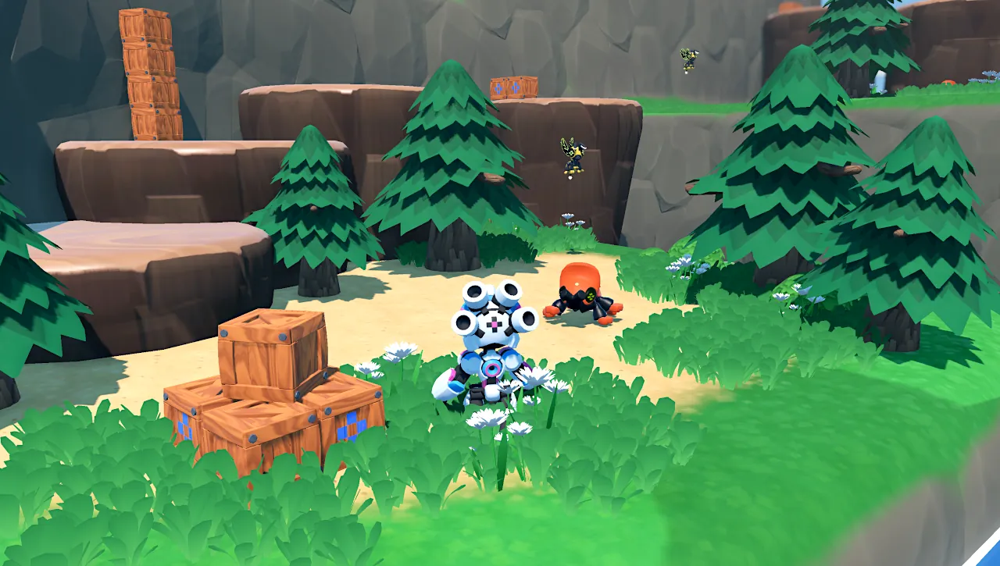
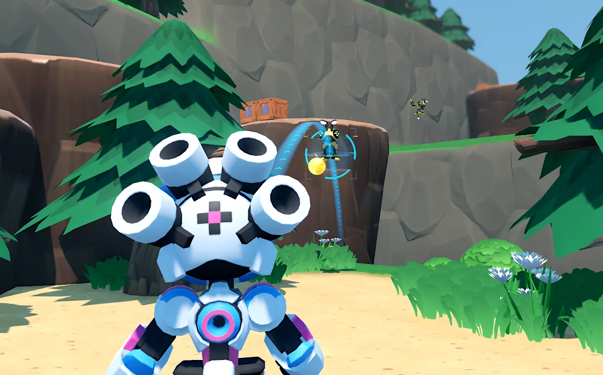

# RoboBlast with Godot LLM addon: Third-Person Shooter demo (Godot 4, 3D)

This open-source Godot 4 demo shows how to create a 3D character controller inspired by games like Ratchet and Clank or Jak and Daxter. You can copy the character to your project as a plug-and-play asset to prototype 3D games with and build upon.

It features a character that can run, jump, make a melee attack, aim, shoot, and throw grenades.

There are two kinds of enemies: flying wasps that fire bullets and beetles that attack you on the ground. The environment comes with breakable crates, jumping pads, and coins that move to the player's character.

## How to run:

1. Download or clone the GitHub repository.
2. Open the project and install the `Godot LLM` addon from the asset library. Alternatively, get the addon from the [github release page](https://github.com/Adriankhl/godot-llm/releases).
3. Download a [supported](https://github.com/ggerganov/llama.cpp?tab=readme-ov-file#description) multimodal model in GGUF format, including botht the language model and the mmproj model. For example, `moondream2-text-model-f16.gguf` and `moondream2-mmproj-f16.gguf` from [this repo](https://huggingface.co/moondream/moondream2-gguf/tree/main).
4. Reload the project, open `LLM/llava.tscn`, point `Model Path` and `Mmproj Path` to the corresponding model file.
5. Press <kbd>F5</kbd> or `Run Project`.
6. Close the demo page, press <kbd>L</kbd> to open the text generation UI, input some texts (e.g. "Describe the environment"), click `Generate`, then close the text generation UI by pressing <kbd>Esc</kbd>.
7. Wait for a while, you will see the generated text appears at the top.

## Controls:

- <kbd>W</kbd><kbd>A</kbd><kbd>S</kbd><kbd>D</kbd> or <kbd>left stick</kbd> to move.
- <kbd>mouse</kbd> or <kbd>right stick</kbd> to move the camera around.
- <kbd>Space</kbd> or <kbd>Xbox Ⓐ</kbd> to jump.
- <kbd>Left mouse</kbd> or <kbd>Xbox Ⓑ</kbd> to shoot.
- <kbd>Right mouse</kbd> or <kbd>Xbox RT</kbd>to aim.
- <kbd>Tab</kbd> or <kbd>Xbox Ⓧ</kbd> to cycle between bullets and grenades.
- <kbd>L</kbd> to open the UI for multimodal text generation, <kbd>Esc</kbd> to close the UI.
- <kbd>Alt</kbd> to toggle mouse capture.

## FAQ:

### How do I use the player character in my game?

Copy the following folders into the root of your project:

- `Player`: contains the main Player assets and scenes.
- `shared`: contains shaders used by the player asset.

The following `Input Map` actions are needed for the `Player.tscn` to work:

- `move_left`, `move_right`, `move_up`, `move_down`: move the character according to the camera's orientation.
- `camera_right`, `camera_left`, `camera_up`, `camera_down`: rotate the camera around the character.
- `jump`, `attack`, `aim`, `swap_weapons`: Action buttons for the character.

The `Player.tscn` scene works as a standalone scene and doesn't need other cameras to work. You can change the player UI by changing the `Control` node inside `Player.tscn`.

## License:

All code is MIT-licensed, and assets are CC-By 4.0 [GDQuest](https://www.gdquest.com/).
